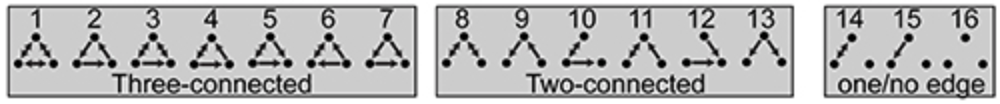

# Network motif analysis
## Tool for creation of and analysis of connection motifs within model networks

Network motifs are descriptions of network connectivity at the level of few elements (in case of neural networks, these
elements are neurons). The simplest motifs describe connectivity between pairs of neurons. Two neurons can be connected 
in four different ways; however, two of these can be viewed as mirror-symmetric, 
resulting in three irreducible 'motifs':

> A &nbsp;&nbsp;&nbsp;&nbsp;&nbsp;&nbsp; B
>
> A &nbsp;&nbsp;--> B
>
> A <--> B

Connectivity between three neurons can be described by 64 'triplet' motifs, which can be reduced to 16 motifs taking 
certain symmetries into account:

Importantly, the relative abundance of certain motifs can impact what types of dynamics can occur in neural networks.

This tool allows investigating the impact of certain features that distinguish neural networks from "random" networks, 
which are completely described by their pairwise connection probability (also known as an 
[Erdős–Rényi_model](https://en.wikipedia.org/wiki/Erdős–Rényi_model)). In contrast, connectivity in neural networks is 
often related to parameters such as the location of neurons or what types of neurons are present in the network.

The file `create_analyze_network.py` demonstrates a small pipeline for creating a neural network with distance- and 
type-dependent connectivity, storing and loading the network and how to compute a triplet motif spectrum (i.e., the occurrence
of different motifs).

